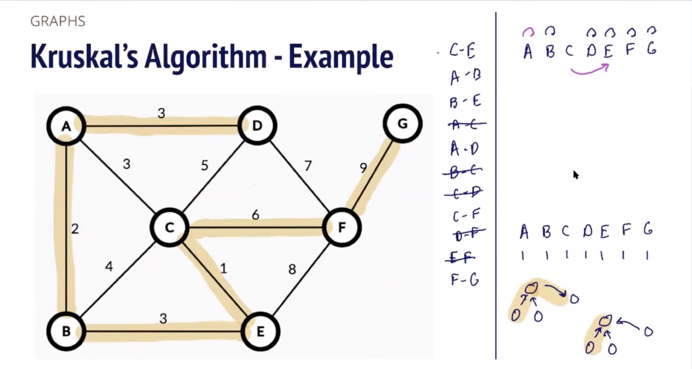
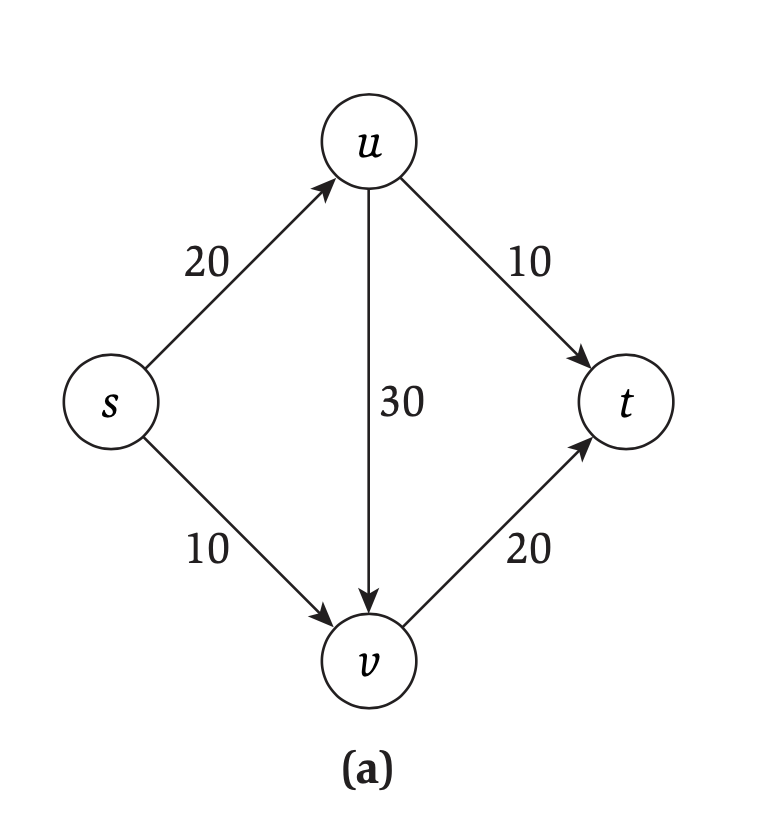

# CS 180

### Introduction

In this chapter, we are going to go through all the algorithm problems taught in CS 180 at UCLA. Some of them occurred in leetcode and I'll include the link to the problem at each section. This will be a more detailed chapter as I'll walkthrough every single detail we talk about in the class and the entire thought process, including the problem definition, problem elaboration, thinking steps, proof, pseudocode or code implemenation in python.

### 1.  Celebrity Problem

**1. Problen Definition: **

In a party of N people, there may or may not be one celebrity. The celebrity is known by everyone else, but the celebrity doesn't know any other people in the party. You mission is to find the celebrity in the party, but you can only ask one question: "Does A know B?", and the answer will be either "yes" or "no" (Assume no one cheat). Find the celebrity by asking the minimum number of question. 


2. **Problem Elaboration:** (From https://www.geeksforgeeks.org/the-celebrity-problem/)

We can describe the problem input as an array of numbers/characters representing persons in the party. We also have a hypothetical function *HaveAcquaintance(A, B)* which returns *true* if A knows B, *false* otherwise. How can we solve the problem.

**Examples:**

```
Input:
MATRIX = { {0, 0, 1, 0},
           {0, 0, 1, 0},
           {0, 0, 0, 0},
           {0, 0, 1, 0} }
Output:id = 2
Explanation: The person with ID 2 does not 
know anyone but everyone knows him

Input:
MATRIX = { {0, 0, 1, 0},
           {0, 0, 1, 0},
           {0, 1, 0, 0},
           {0, 0, 1, 0} }
Output: No celebrity
Explanation: There is no celebrity.
```


3. **Three Approaches:**

   1)  **Brute-Force Approach:**

   For each person, we ask him/her if he/she knows everyone else. If he/she doesn't know anyone in the party, check whether everyone else in the party know him/her. If so, he/she is the celebrity. 

   (P.s. It is possible that we can ignore cases like if A knows B, then we don't need to ask if A knows C, as A is already not the celebrity by definition, but it doesn't change the asyntoptic time for worst cases)

   

   **Time Complexity Analysis:**

   <u>Time Complexity: O(n^2):</u>

   - Though the problem uses a matrix for representation, we can approach the problem using a graph. Consider a Graph G = (V, E) as follows. There is a vertex for each of the n guests and an edge from u to v if guest u knows guest v. The celebrity is the vertex with indegree N - 1 and outdegree 0.

     

   - We compute the diagraph G explicitly by calling hasEdge(u,v) for each potential edge. At this point, we can check whether a vertex v is a celebrity by computing its indegree and out degree. The diagraph has at most n(n - 1) edges, so the time complexity is O(n^2)

    

   - The reason why there are at most n(n - 1) edges is because for every person, it is possible every person knows every other person and there is no celebrity. 

     

   2) **Elimination-and-Verification Approach:**

   - For each asking, it is possible to eliminate one person as the celebrity. Assume there are any two persons A, B, there are two cases:

     1. A knows B: Then it is not possible for A to be the celebrity as the celebrity don't know anyone

     2. A doesn't know B: Then it is not possible for B to be the celebrity as the celebrity should be known by everyone

        

   - <u>If we put the logic in the digraph then:</u>

     **if there is an edge from u to v, then u is not the celebrity; if there is not an edge from u to v, then v is not the celebrity.**

     We can use this idea repeatedly to eliminate all vertices except the celebrity.

     

     For simplicity, we are not using a digraph for the implemenation: The following is the code based on problem elaborations' matrix. We will use a stack to store all the candidates.

     

     1) <u>Elimination:</u> 

     ```python
     # Problem Elaboration shows the matrix, return if a knows b
     def knows(a, b):
       return MATRIX[a][b]
     
     def eliminate(n):
       stack = []
       # Push every candidate indexed from 0 to n - 1 to the stack
       for i in range(n):
         stack.append(i)
         
       # Pick two candidates (could be random)
       a = stack.pop()
       b = stack.pop()
       
       # Find the potential celebrity
       while len(stack) > 1:
         if knows(a, b):
           a = stack.pop()
         else:
           b = stack.pop()
       
       # There are still one candidates in the stack, edge case solving
       celebrity = stack.pop()
       
       if knows(celebrity, a):
         celebrity = a
       if knows(celebrity, a):
         celebrity = b
         
       return celebrity
       
     ```

     2) <u>Verification:</u>

     ```python
     def verify(c):
       for i in range(len(MATRIX)):
         if i != c and (not knows(i, c) or knows(c, i)):
           return False
       return TRUE
     ```

     <u>Main:</u>

     ```python
     candidate = eliminate(len(MATRIX[0]))
     return verify(candidate)
     ```

     **Time Complexity:** O(n)

     The maximum total number of comparisons is n-1, and in the verification phase, it at most takes 2(n - 1) steps. So, in total these steps take 3(n - 1) operations, which is O(n) indeed.
     
   - Note: there is optimization that could reduce the operation to 2(n - 1). But since it doesn't change the asymptotic time, we'll not discuss them as it doesn't really matter.


### 2. Egg Drop Problem

1. **Problem Definition:** https://medium.com/@parv51199/egg-drop-problem-using-dynamic-programming-e22f67a1a7c3

Given a certain amount of floors of a building (say f number of floors) and also given certain amount of eggs (say e number of eggs) …

What is the **least amount of egg drops** one has to perform to find out the **threshold floor**? (Threshold floor is one from which the egg starts breaking and also egg breaks for all the floors above. Also, if egg dropped from any floor below the threshold floor, it won’t break.)


**Constraints:**

1. An egg that survives a fall can be used again.
2. A broken egg must be discarded.
3. The effect of a fall is the same for all eggs. (All eggs are identical in function)
4. If an egg breaks when dropped, then it would break if dropped from a higher floor.
5. If an egg survives a fall then it would survive a shorter fall.


2. **One Egg Case:**

One egg case is pretty trivial. We'll do a loop from 1st to nth floor. If it breaks, then we find the threshold floor. Notice we cannot do a binary search in one egg case because if it breaks on certain middle floor, then we can not use it again to search in sub regions.


3. **Two Egg Case:**

Two egg case is what makes this problem a little interesting. As always, we can do a for-loop to find the threshold floor. **But it is not the least amount of egg drops to find the threshold**. 

You might be attempt to use an approach like binary search, but it in the worst case would require n/2 steps (If there are n floors and first egg breaks just at n/2th floor). This is clearly not the best approach, and there must be better partition that makes the worst case smaller than n / 2.

Let's try an algorithm and prove it is the best strategy: Assume there are 2 eggs and k floors

A good question to ask: "Are we able to cover all the floor with x drops?"

By asking this question, remember what we are doing: Try finding the boundary floor in each partition.

In order to go to one partition, we need to use one step, so if we truly want to use two eggs to find the boundary floor, assume in the first partition we have n floors, then the second partition will be n - 1 floors, third will be n - 2...

So we'll have:

n + n - 1 + n - 2 + n - 3 + n - 4 +... + 1 >= x

To reach the best partition size for finding the boundary.


4. **M Egg Case:**

   There isn't one uniform best case I guess, but I'll discuss about how to find the best of worst case using DP in the future but I think the logic is to repeat what we've done in two egg case.

### 3. Stable Marriage Problem

1. **Problem Definition: **https://en.wikipedia.org/wiki/Stable_marriage_problem

The **stable marriage problem** is the problem of finding a stable matching between two equally sized sets of elements given an ordering of preferences for each element. A matching is *not* stable if:

- There is an element *A* of the first matched set which prefers some given element *B* of the second matched set over the element to which *A* is already matched, and

- *B* also prefers *A* over the element to which *B* is already matched.


Another definition: Given *n* men and *n* women, where each person has ranked all members of the opposite sex in order of preference, marry the men and women together such that there are no two people of opposite sex who would both rather have each other than their current partners. When there are no such pairs of people, the set of marriages is deemed stable.

2. **Problem Elaboration**:
   - The first set is a set of men and the second set is a set of women. So the name of the problem makes more sense.
   - We will use M and W with number to denote specific man and woman (e.g. W1 is Woman No.1)

3. **Brute-Force Solution**:

   - Randomly shuffle matching and check until we find a correct matching

   - In this problem, brute-force solution doesn't matter so much

     

4. **Gale-Shapley Algorithm:**

   - Pick an arbitrary man that is not matched yet.

   - Let him propose to the woman he prefers the most but have not proposed yet. 
   - Then, for the proposed woman, let she check if the man is better than her current match (If she doesn't have a current match, then assume the man is better). 
   - If better, the woman will match to the man and previous matched man will lose his match.

   - This process is repeated until everyone is engaged.

     

5. **Proof of Algorithm**:

   - Assume by contradiction there is instability by using this algorithm
     - i.e. In the end, there is some man M1 who prefers W2 over W1 and W2 also prefers M1 over M2 in the matching (M1, W1) and (M2, W2)
     - Then, if we ask the question: "Has M1 proposed to W2 yet?" There are two cases:
     - 1) M1 hasn't proposed to W2 yet but is matched with W1: Therefore, M1 must prefer W1 over W2 as our algorithm gurantees M1 proposed to woman with higher preference first and form a matching. Contradiction
     - 2) M1 has proposed W2, but W2 switched to M2 or stick with M2 in the end. Then, M2 has to be of higer preference by W2 otherwise either a switch or a stick-with is not possible. Contradiction.

   - By contradiction, we prove the correctness of our algorithm.

     

6. **Time Complexity:**

   O(n^2): For each man, it is possible for him to propose to at most n woman to get a match.

### TA: 4. Find All primes Below N


### 5. Time Slot Problem

1. **Problem Definition:** https://cs.brynmawr.edu/Courses/cs330/spring2016/presentations/GreedyIntervalScheduling.pdf

Given a set of intervals, start time and finish time, find the group of intervals where we can schedule the maximum number of jobs in non overlapping time slots. 


2. **Some intutions:**

- You might start with some ideas like picking the shortest intervals, picking the intervals that start the earliest...
- But soon you realize there are counter examples if you pick intervals in the above manners.
- However, at this point, you are using the the key technique for proving the correct algorithm: Proof by Contradiction


3. **Correct Algorithm: Greedy**

   - Always pick the interval that ends first and eliminate the overlapping intervals

     

4. **Proof of correctness**:

   - Let A be a set of interval I picked using the correct algorithm, and let B be the set with the most non-overlapping intervals
   - Let interval i be the last interval that A and B both have. Assume the next interval of i in A is a and the next interval of i in B is b
   - By using our algorithm, a must end earlier than b, so if b could be an interval in the best set, a could also be an interval in B without overlapping with subsequent intervals.
   - So, we could replace b with a in B.
   - We repeat the process until the end.
   - In the end, when A only has one interval but B has several other intervals (Assume B is the best so B has more intervals than A), but these other intervals should also be picked by our algorithm as they are not overlapping with the last interval in A. So, we reached a contradiction
   - By using induction and proof by contradiction, we proved the correctness of our algorithm


### BFS

1. **Algorithm Definition:** https://en.wikipedia.org/wiki/Breadth-first_search

   - **Breadth-first search** (**BFS**) is an [algorithm](https://en.wikipedia.org/wiki/Algorithm) for traversing or searching [tree](https://en.wikipedia.org/wiki/Tree_data_structure) or [graph](https://en.wikipedia.org/wiki/Graph_(data_structure)) data structures. It starts at the [tree root](https://en.wikipedia.org/wiki/Tree_(data_structure)#Terminology) (or some arbitrary node of a graph, sometimes referred to as a 'search key'[[1\]](https://en.wikipedia.org/wiki/Breadth-first_search#cite_note-1)), and explores all of the neighbor nodes at the present depth prior to moving on to the nodes at the next depth level.

2. **Algorithm Property:**

   - BFS visits nodes in levels. It will form a tree (BFS tree) after the entire traversal. In this tree, what BFS did was a level-order traversal. And each node has their corresponding level and the level is the same as the shortest distance from root to this node.

3. **Algorithm Implementation:**

   - Use a queue

   - ```
     1  procedure BFS(G, root) is
      2      let Q be a queue
      3      label root as discovered
      4      Q.enqueue(root)
      5      while Q is not empty do
      6          v := Q.dequeue()
      7          if v is the goal then
      8              return v
      9          for all edges from v to w in G.adjacentEdges(v) do
     10              if w is not labeled as discovered then
     11                  label w as discovered
     12                  Q.enqueue(w)
     ```

4. **Proof of Shortest Distance:**

   - Assume we derive a path from S to Xi using BFS (By definition the path passes S, X1, X2, X3, ..., Xi) 

   - So Xi is at level i in BFS

   - Assume there is a shorter path from S to Xi with distance j < i (By definiton, the path passes S, Y1, Y2, ..., Xi)

   - Then in this shorter path, Y1 is at level 1 or less, Y2 is at level 2 or less, ...., Xi is at level j or less.

   - However, since Xi is at level i > j, this contradicts to our assumption.

     

5. **Time Complexity:**

   - **O(n^2)**: From vertex perspective, every node has n - 1 neighbors

   - **O(e)**: From edge perspective, you only need to visit all edges in the graph

   - **O(n + e)**: If the graph is not connected, then you also want to keep track of an array of nodes, so O(n + e) should be 

     the general case

   

   ### DFS

   1. Already pretty familiar
   2. **Property:** If DFS finds one back edge, then the graph has a cycle

   

   

   ### Topological Sort

   - In [computer science](https://en.wikipedia.org/wiki/Computer_science), a **topological sort** or **topological ordering** of a [directed graph](https://en.wikipedia.org/wiki/Directed_graph) is a [linear ordering](https://en.wikipedia.org/wiki/Total_order) of its [vertices](https://en.wikipedia.org/wiki/Vertex_(graph_theory)) such that for every directed edge *uv* from vertex *u* to vertex *v*, *u* comes before *v* in the ordering.
   - Topological ordering <-> DAG

   

   - Algorithm:

     - While there is a source:
       - Find an arbitrary source
       - Output the source
       - Delete the source and all of its outgoing edges

   - **Time Complexity**: **O(n + e)**

   - Construction of the graph

     **Vertex:** O(n^2) since we need to visit n - 1 vertices, and each vertex needs to at most update n - 1 indegree

     **Edge:** O(n + e): add one to the indegree of the vertex that ends an edge and outdegree of the vertex that starts an edge

     

   - Find a source: O(n)

   

   ### 2 Color Problem

   **Problem Definition:** 

   - Given two colors, color a graph so that no neighboring nodes have the same color

   **Problem Elaboration:**

   - This graph cannot contains an odd cycle (a cycle with an odd number of nodes). Odd cycle is unsolvable

   **Algorithm**:

   - Use BFS, alternatively color nodes on the same level with the same color.

   

   **Proof of Algorithm**:

   - If this algorithm doesn't work.
   - I.e. there is an edge between nodes on the same level 

   - Then, the graph must contain an odd cycle from the srouce to these two nodes. Contradicting to the assumption

   

   ### Dijkstra Algorithm

   **Problem Definiton:**

   - Given an weighted undirected graph, find the shortest path from source vertex s to some target vertex t

   

   **Algorithm:**

   - Put every node with distance infinity into a priority queue. Mark s with distance (priority 0).
   - While there are unvisited node in PQ:
     - Pick the node with the lowest priority, relax its outgoing edges
     - remove this node from PQ (or keep it in an array with the final distance)
   - When every node is visited, we have the shortest distance from s to eevery node

   

   **Proof of Algorithm**:

   - At start, dist[s] = 0, which is optimal.
   - After relaxing all edges from source, let vertex v1 be the vertex with minimum weight, i.e. closest vertex to the source. dist[v1] is optimal and future relaxation on v1 will fail:
     - dist[p] >= dist[v1] for any other node
     - dist[p] + w > dist[v1]
   - Using induction with the same logic for every node, we can prove this holds for every nodes in the graph.

   

   **Time Complexity**:

   O(elogn):

   - We are going to check at most e edges to find a SPT (shortest path tree with n - 1 edges): O(e)
     - Update at most n - 1 nodes for relaxation for any node
   - Heapify would take logn time per step

   

   ### Minimum Spanning Tree

   **Definition of Spanning Tree:**

   - A tree that connects all the vertices in the graph is called "Spanning Tree"
     - Aside: If you have a cycle, you can remove and must remove one edge to form a spanning tree

   

   **Definition of Minimum Spanning Tree:**

   - A spanning tree with the smallest total weight
   - undirected graph
   - Property: MST is not unique if the graph contains a cycle and every edge in the cycle has equal weights for minimal weights

   

   There are two algorithms for finding the MST: PRIM and Kruskal

   

   ###  PRIM MST Algorithm

   - Initialize an empty array visited that keeps track of all the nodes that we've visited

   - Pick an arbitrary node in the graph, put it into visited

   - For each of the edge connecting from visited node(s) to unvisited node(s):

     - find the edge with smallest weight and add the unvisited node into visited

     - Repeat this process until every node is visited

       

   **Property:**

   - Assue all edges are of unique weights (We made this assumption to simplify the proof)
   - Then, the edge with minimum weight connecting these two partitions, aka Emin, should be in the MST

   

   

   **Proof of PRIM MST Algorithm:**

   - Assume at some point of the algorithm we have two non-empty partitions: V1 and V2
   - Assume there is an edge Emin representing the edge with minimum weight connecting these two partitions, this Emin should be in MST
   - Assume by contradiction Emin is not in the final minimum spanning tree
     - Then, if connecting Emin in this final MST, there would be a cycle
     - At this point, if we delete one edge Ex connecting these two partitions, we'll create a new spanning tree
     - Since Emin < Ex, this new spanning tree has smaller weight than the spanning tree by assumption
   - So our algorithm holds by contradiction, and since each step of algorithm is to pick the Emin between Visited and Unvisited partition
   - This is aka **MST theorem**

   

   **Time Complexity**:

   O(elogn): If we use the heap and the adjacency list. Every time we put a vertex from unvisited partition to the visited partition, we need to update the distance of unvisited nodes to the nodes in the visited partition. Heapify of n nodes take log(n) time and there are at most e edges so we'll do at most O(e) heapify operation

   

   

   ### **Kruskal Algorithm:**

   **Introduction:**

   Kruskal algorithm is another greedy algorithm for finding the MST. Differ from PRIM algorithm, Kruskal is edge-centric. 

   

   **Algorithm:**

   - Initialize a parent array of node to node itself and rank array of node to 0
   - Create a MST set

   - Sort all the edges
   - for each edge {u,v} in E:
     - If Find(u) != Find(v): (putting {u, v} into MST doesn't create a cycle)
       - Add edge {u, v} to MST
       - Union(u, v)
   - return MST

   

   - P.s: Prims Algorithm doesn't create a cycle because every update increases one vertex in the existing MST

   

   Union(x, y):

   - u = find(x), v = find(y)
   - if u == v: return
   - if rank(u) > rank(v): parent(v) = u
   - Else:
     - parent(u) = v
     - if rank(u) == v: rank(v) + 1

   

   Find(x):

   - While x != parent(x):
     - x = parent(x)
   - return x

   

   #### Union Find

   e.g. [(1, 5), (3), (7, 8, 9)]

   - Two operations:
   - Find(1, 5): find if 1 and 5 is in the same group, return true or false
     - Small modification: Find(1) and Find(5) returns the name of the union, so if the names are the same, 1 and 5 are in the same group
   - Union(5, 3): assume every group has a name, i.e. some arbitrary element in the group, Union(5, 3) means merging two groups so it becomes (1, 5, 3) with the name 5 (arbitrary number in the new group)

   

   **Algorithm:**

   e.g.

   - A, B, C, D, E, F, G are every vertex in the graph
   - Parent: [A, B, C, D, E, F, G]
   - Rank: [1, 1, 1, 1, 1, 1, 1]

   

   **Time Complexity Analysis of Union Find**

   1. Brute Force

   - If we just use a naive rooted BST, the worst case would be O(n) for find and O(1) for union

     

   2. Shallow Tree

   - Find takes O(1), but union takes O(n) since we might need to check every node before union

     

   3. Balanced Tree

   - Find takes O(logn), and union takes O(logn) since we need to first find the parents of two unioned nodes
     - the merge part if O(1)

   - There are tricks we can do to balance the tree

   

   With Union Find, we are able to detect whether a new edge would create a cycle, that finishes our Kruskal's algorithm.

   

   **Time Complexity for Kruskal Algorithm**

   - O(elogn) / O(eloge): The for loop takes O(e), and find operation takes O(loge) time

   

   

   - In this example, the first step we did was we picked edge {c, e}. In the find operations, clearly there is no cycle. In the union operation, we add c's parent to e, and we increase the rank of E by one since both c and e have rank 1

   

   

   ### Clustering

   **Introduction:**

   ​	Clustering is a fairly interesting topic. In the machine learning course, we learned algorithms like K-Mean. But in CS 180, we were introduced to another clustering algorithm

   ​	The goal for clustering is to maximize the minimum distance between clusters, so we would have a clearer clustering configuration in the end

   

   **Problem:**

   - Given a weighted graph, partition the graph into k clusters, maximize the minimum distance between clusters

   

   We can also use Kruskal algorithm for solving the clustering problem. Of course,  a modified version.

   

   **Algorithm:**

   - Kruskal
     - Sort all edges. Set n = the number of vertices
     - Whenever picking an valid edge, n decrease by 1
     - When we have n == k, stop the algorithm

   

   **Proof of this algorithm:**

   - Assue by contradiction after running the above algorithm, we don't have an optimal cluster
     - Assume the clustering configuration from our algorithm is {C1, C2, C3, ..., Ck} and the optimal clustering configuration is {C'1, C'2, ... , C'k}
   - So, there exists at least on cluster Cr which have nodes that are shared between C'd and C'f
   - For any vertex Pi in C'd and Pj in C'f, there must be some edge connecting between them (since they are clustered in our algorithm)
   - However, {Pi, Pj} must be smaller than or equal to some edges we picked, otherwise we wouldn't pick this edge
   - Since after running our algortihm, the minimum distance is larger than any of the edge we picked (since we sorted every edge and left large edges unpicked), {Pi, Pj} < the minimum distance, contradiction

   

   

   ### Merge Sort

   **Introduction:**

   We've covered everything about sorting in code in the sorting section, so in this part I'll introduce some mathy proof and more intuition behind our famous O(nlogn) sorting algorithm

   

   **Algorithm:**

   Mergesort(list):

   - Base case:
     - If there is only one element, return list

   - Inductive step:
     - left = Mergesort left half of the list
     - right = Mergesort right half of the list
     - return merge(left, right)

   

   Merge(l1, l2):

   - Initialize two numbers a and b to 0 and an empty array result
   - While a < l1.length and b < l2.length
     - If l1[a] < l2[b]: append l1[a] to result, a++
     - Else: append l2[b] to result, b++
   - If either a != l1.length or b != l2.length:
     - append the rest (from index a or index b onward) of the array to result
   - return result

   

   **Time Complexity**:

   - O(nlogn), but this time I'll go over formal merge sort time complexity proof

   

   The number of comparisons used by mergesort on an input of size n satisfies the following recurrence relation

   - T(n) = 2T(n / 2) + n

   

   To solve the recurrence relation, we can start a repetitive process. Aka: Iteratively substitute:

   T(n) = 2T(n / 2) + n

   T(n / 2) = 2T(n / 4) + n / 2

   T(n / 4) = 2T(n / 8) + n / 4

   ...

   T(2) = 2T(1) + 2

   

   T(n) = 2T(n / 2) + n = 4T(n / 4) + 2n = 8T(n / 8) + 3n = ... = 2^(k) * T(n / 2^k) + kn, where k = logn and 2^k = n

   so we get, T(n) = nT(1) + nlogn, assume we know T(1) = 1, then

   - T(n) = n + nlogn

   

   Thus, merge sort is O(nlogn)

   

   #### Iterative substitue another example: Binary Search

   **Introduction: **

   - Since we've summarized binary search before, let's just do another proof for binary search's time complexity

   

   The recurrence relation for binary search is

   T(n) = T(n / 2) + 1

   T(n / 2) = T(n / 4)  + 1

   ...

   so T(n) = T(n / 2) + 1 = T(n / 4) + 2 = ... = T(1) + k,  where k = logN and 2^k = n

   so we get T(n) = T(1) + logN,

   

   Thus, binary search is O(logn)

   

   ### Inversion count

   **Problem:**

   - You have 1 2 3 4, given a permutation of it e.g. 3 1 2 4
     - An inversion is where a number on the right is smaller than the number on its left
     - In this permutation, there are two inversions, namely 3 1 and 3 2.

   - Your goal is to count the number of inversions

     

   **Algorithm:**

   - We'll use the idea of merge sort to solve this problem.

   - The intuation is that if we divide the sequence into two halves, and use two pointers, left and right, to traverse these two halves, when the left pointer is pointing to a value larger than the value pointing to by the right pointer, then every subsequent numbers in the left half should be larger than the value the right pointer is pointing now. So we could increase n / 2 - left to the number of inversions

     

   InversionCount(list):

   - inverts = 0

   - left, leftInverts = InversionCount(left half of the list)
   - right, rightInverts = InversionCount(right half of the list)
   - inverts += (leftInverts + rightInverts)
   - return merge(left, right)

   ​	

   Merge(l, r):

   - count = 0

   - merged = []

   - p = 0; q = 0

   - while(p <= l.length and q <= r.length):

     - if l[p] > r[q]:
       - Merged.append(r[q])
       - count += l.length - p
       - q += 1

     - Else:
       - Merged.append(l[p])
       - p += 1

   - If there are anything left on l or r, append them to merged

   - return merged, count

   

   **Time Complexity and Proof of algorithm:**

   - The proof for this problem is very similar to the proof of mergesort. We only need to realize that the update rule of inversions, i.e. intuition, is correct, then it is fine
   - The runtime for this algorithm is still O(nlogn), since updating the count also only takes constant time and the rest of the algorithm is essentailly the same as the merge sort

   

   ### Closest Pair Problem

   #### Problem:

   - Given an array of points in the plane, find out the closest pair of points in the array.

     

   #### Algorithm:

   https://www.geeksforgeeks.org/closest-pair-of-points-onlogn-implementation/

   - Sort all points according to x coords
   - Divide all points into two halves
   - Recusively find the smallest distance in both subarrays
   - Take the minimum of two smallest distances. Let the minimum be d
   - Create an array strip[] that stores all points which are at most d distance away from middle line dividing the two sets
   - Find the smallest distance in strip
   - Return the min of d and the smallest distance in previous step

   

   If strip[] is sorted according to y coordinate, we can find the smallest distance in strip[] in O(n) time. The idea is to presort all points according to y coords. Let the sorted array be Py[]. When we make recursive calls, we need to divide points of Py[] also according to the vertical line. We can do that by simply processing every point and comparing its x coord with x coord of the middle line

   

   According to wikipedia: https://en.wikipedia.org/wiki/Closest_pair_of_points_problem

   The key observation is based on the following sparsity property of the point set. We already know that the closest pair of points is no further apart than d. Therefore, for each point *p* to the left of the dividing line we have to compare the distances to the points that lie in the rectangle of dimensions (d, 2 * d) bordering the dividing line on the right side, as shown in the figure. And what is more, this rectangle can contain at most six points with pairwise distances at least dRmin. Therefore, it is sufficient to compute at most 6*n* left-right distances in step 4.[[6\]](https://en.wikipedia.org/wiki/Closest_pair_of_points_problem#cite_note-6) The recurrence relation for the number of steps can be written as *T*(*n*) = 2 *T*(*n*/2) + *O*(*n*), which we can solve using the [master theorem for divide-and-conquer recurrences](https://en.wikipedia.org/wiki/Master_theorem_(analysis_of_algorithms)) to get *O*(*n* log *n*).

   

   

   - It's not expected to know 6 points on the right, just constant number of points (8 points are also OK in CS 180)

   

   **Time Complexity**

   O(nlogn): the merge step takes O(n) time, solving the recurrence relation *T*(*n*) = 2 *T*(*n*/2) + *O*(*n*) essentailly yields the same result as the merge sort

   

   ### DP

   I put every question, techniques, and proofs into dp.md. Check it out: [dp.md](./dp.md)

   

   ### Network Flow

   **Introduciton**: In this secion, we'll go over some common network flow problems and an algorithm specifically to tackle this problem - Ford-Furkson algorithm

   

   **Problem:**

   - Assume we are given a flow network, what is the maximum flow we can get from source node s to target node t without exceeding the capacity of any edges?

     

   Formally, we’ll say that a *flow network* is a **directed graph** *G* = (*V* , *E*) with the following features.

   - Associated with each edge *e* is a *capacity*, which is a nonnegative number that we denote *C_e*.

   - There is a single source node s

   - There is a single sink node t

     

   **Constraints:**

   - No edge enters the source s and no edge leaves the sink t
   - There is a t least one edge incident to each node
   - All capcactities are integers

   

   **Definition of Flow**:

   - We say that s-t flow is a function f that maps each edge e to a nonnegative real number, f: E -> R+, the value f(e) intuitively represents the flow carried by edge e. A flow f must satisfy the following two properties
     - Capacity Constraints: For each e in E, we have 0 <= f(e) <= Ce
     - Conservation Conditions: For each node v other than s and t, we have f(e)_in = f(e)_out

   

   **Intuition:**

   - A greedy approach might work in first intuition, which makes sense but not correct:

     **Wrong Algorithm**:

     - Find any path from s to t, send one unit at a time
     - If a path is saturated, meaning it has a flow as the same as the capacity, remove that edge
     - Repeat until there is no s-t path, compute inflow of t in the end

     **Time Complexity:**

     - O((n + e) * f), where f is the flow, n + e is probably from using BFS to find the path between s and t

   - However, this approach is wrong, for example (we only need one counter example to disprove the algorithm)

     

   

   - In the above example, if we push 20 units throught the path s->u->v->t, this disables all the path from s to t and the flow after this algorithm is 20. But clearly, if we push 10 units in s->u->t,  s->u->v->t and s->v->t respectively, the max flow is 30 instead.
   - So, we need some way to backtrack once we made mistakes.
   - This introduces to the new concept -- Residual Network


​	**Residual Network**

- Given a flow network *G*, and a flow *f* on *G*, we define the *residual graph G_f* of *G* with respect to *f* as follows.

  - The node set of *G_f* is the same as that of *G*.

  - For each edge e = {u, v} of G on which f(e) < Ce, there are Ce - f(e) "leftover" units of capacity on which we could try pushing flow forward

    So we include the edge *e* = (*u*, *v*) in *G_f* , with a capacity of Ce − *f* (*e*). We will call edges included this way *forward edges*.

  - For each edge *e*=(*u*,*v*) of *G* on which *f*(*e*)>0, there are *f*(*e*) units of flow that we can “undo” if we want to, by pushing flow backward. So we include the edge *e*′ = (*v*, *u*) in *G_f* , with a capacity of *f* (*e*).

- Note that each edge *e* in *G* can give rise to one or two edges in *G_f*: If 0<*f*(*e*)<Ce it results in both a forward edge and a backward edge being included in *G_f* .


**Algorithm: Ford-Fulkerson** 

- Find a augmenting path from S to T

- Compute the bottleneck capacity (minimum residual capacity of any edge on P, with respect to the flow f)

- Augment each edge and the total flow

  

**Augmenting Paths**

- Def: An augmenting path is simply a path whose edges are either non full and forward and non empty and backward
-  Augment is the operation to update the path. We define augment as follows:

- Augment(f, P) 

  - Let b = bottleneck(P, f) 

  - For each edge {u, v} in P:

    - If e = {u, v} is a forward edge then
      - Increase f(e) in G by b

    - Else e is a backward edge, let e' = {v, u}
      - decrease f(e) in G by b # i.e. Decrease the corresponding flow in forward edge by b

  - return f


Before we jump into the proof of this algorithm, there are several other concepts that we need to understand

- **Min Cut**
  - Partition the graph into two partitions A and B, with s and t in different partitions (we assign s to the left and t to the right)
  - Cut(A, B) = sum(Capacity of edges)
  - Min cut is the minimum cut among all cuts
  - If we disconnect the edges between the partitions, there is no path from s to t
  - s-t flow should be <= min cut, so it is smaller than or equal to any cut


**Proof of Ford-Fulkerson Algorithm**

- Claim the following three statements are equivalent:

  1. f is a max flow in graph G

  2. the residuatl network Gf has no augmenting paths

  3. |f| = cut(S, T) for some cut (S, T) of G

- **Proof of 1 -> 2**:

  - By contradiction, assume that G has an augmenting path
  - if an augmenting path exists, the max flow can still be increased by at least 1 unit
  - This is a contradiction

- **Proof of 2 -> 3:**

  - If we remove all saturated paths, we disconnect s and t, otherwise it violates the condition that there is no augmennting path
  - This creates a cut if we consider all reachable nodes from s to be in set S and all the remaining nodes in set T
  - Then |f| = cut(S, T), since flow must leave S through each of the cut edges e, and the flow over each e is equal to c(e) because e was saturated to begin with

- **Proof of 3 - > 1:**

  - Since |f| <= the capacity on any cut and |f| = cut(S, T) for some cut, this is the maximum flow that can be achieved
  - As a side effect, the cut created in 2 -> 3 is exactly the min-cut on N

- Thus, since 1->2->3->1, the three statements are equivalent, the Ford-Fulkerson algorithm is correct


### NP-Complete & NP-Hard

**Introduction**

- Some problems are inheritly hard to solve, and a lot of professionals have worked on those problems but simply cannot find a solution. Then, if at some moment you have a problem you cannot solve no matter what method you try, you might want to refer to the unsolvable problems and see if you problem could be transferred to one of the unsolvable problem

- This is the intuitiion behind NP-hard problem - Transform our problem to other NP-hard problem

  

**Paradiagm**


- Y is polynomial reducible to X if:
  - If we can change the input of Y to understandble X input, and transform X's output to Y's output
  - Transform input and output are polynomial time transferable


- Suppose Y <=p X, if X can be solved in polynomial time, Y can be solved in polynomial time (X is easy, so is Y)
- Suppose Y <=p X, if P cannot be solved in polynomial time, X cannot be solved in polynomial time (Y is hard, so is X)
  - Assume by contradiction X can be solved in polynomial time, since Y <=p X, we can transform Y's input to X and transform X's input to Y, these transformations take polynomial time. Since X also takes polynomial time, we can get Y's output in polynomial time. Contradiction


- Max Clique <-> Max Independent Set <-> Max Vertex Cover <-> Max Set Cover


False statements:

- NP completeness is not solvable,
- NP is exponential
- NP is polynomial time problem, even though high polynomial
- NP-complete is transformable to NP-Complete problem


